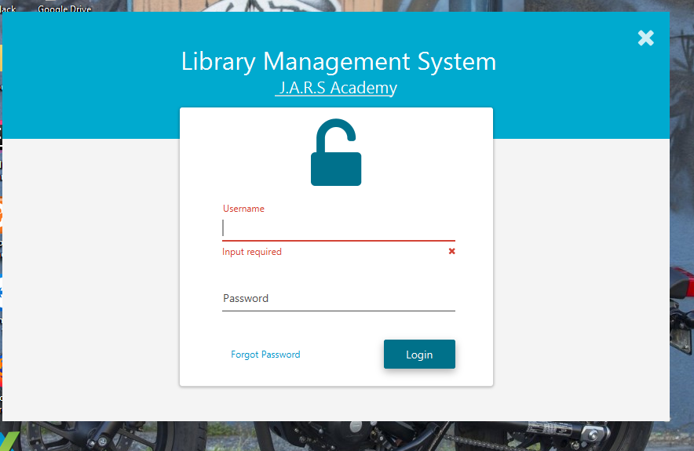
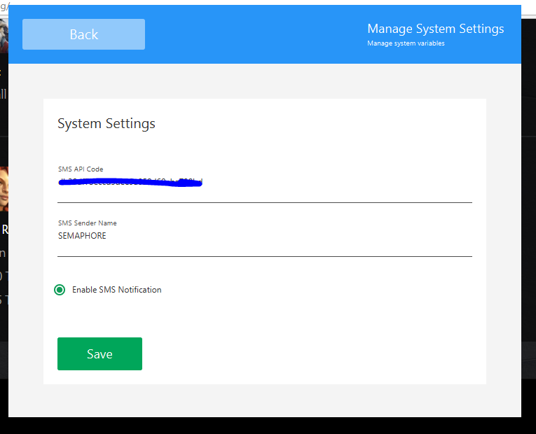
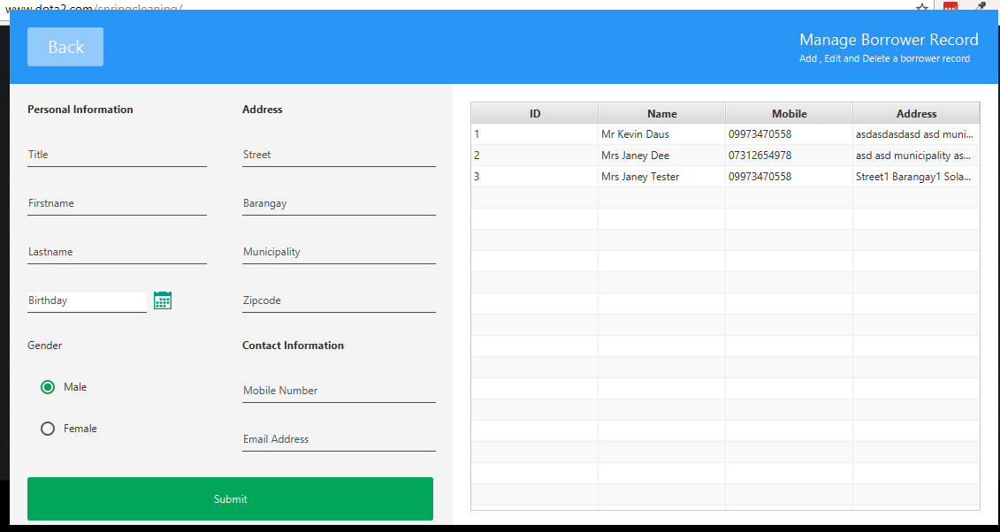

#  Library Management System using JavaFx

## Discription
A Library Management System is a software built to handle the primary housekeeping functions of a library. Libraries rely on library management systems to manage asset collections as well as relationships with their members. Library management systems help libraries keep track of the books and their checkouts, as well as members’ subscriptions and profiles.

Library management systems also involve maintaining the database for entering new books and recording books that have been borrowed with their respective due dates.

## Screenshot

## CHANGELOG
### [1.0.1](https://github.com/kevindaus/library-management-system-javafx/releases/tag/1.0.1)
ADD = sms notification  
ADD = return book   
ADD = overdue worker  
ADD = settings management  
ADD = view recently penalized borrower report  
ADD = view total penalty record   
ADD = borrow book panel  
ADD = return book panel  

### [1.0.0](https://github.com/kevindaus/library-management-system-javafx/releases/tag/1.0.0)
ADD = manage book , borrower and user

### Tech and library used
* [JavaFX](http://www.oracle.com/technetwork/java/javafx/overview/index.html) - Java UI framework
* [MySql](https://www.mysql.com/) - database
* [SMS Gateway](https://semaphore.co/)
* [jfoenix](http://www.jfoenix.com/) - JavaFX Library
* [Unirest](http://unirest.io/) - REST Client
* [fontawesomefx](https://bitbucket.org/Jerady/fontawesomefx) - JavaFx Library
* [Controls Fx](http://fxexperience.com/controlsfx/)

## TEAM MEMBERS
* Khashimakhun Abidzhanov
* Aliia Shalpykova
